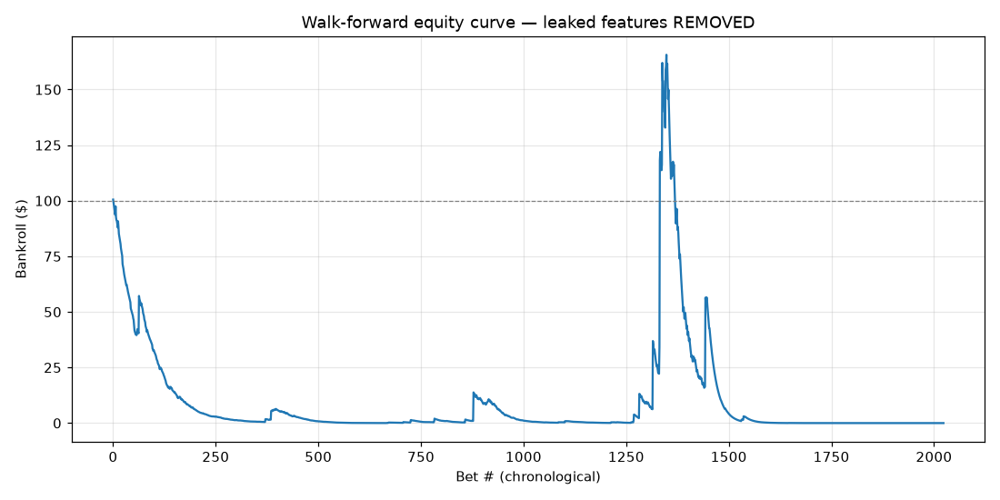
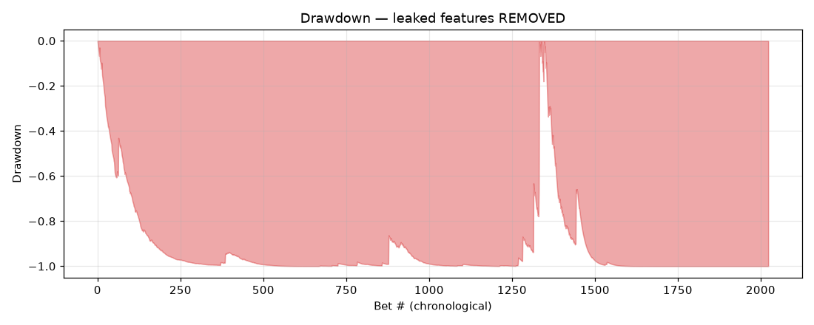
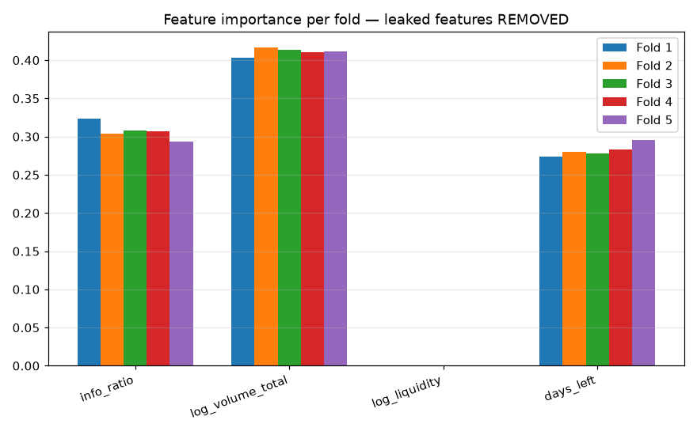

# E1b — AlphaFeed XGBoost backtest, leaked features REMOVED

Same walk-forward harness as `backtest/report.md`, but with `yes_price`
and `price_extremity` masked from the model's feature matrix. The four
remaining features (`info_ratio`, `log_volume_total`, `log_liquidity`,
`days_left`) are the only inputs.

## Verdict (manually overridden after inspecting per-fold numbers)

**Mixed.** Two coexisting truths:

1. **There IS signal in the non-price features.** Mean test AUC 0.616 is
   the industry-normal range for prediction-markets models, and per-bet
   Sharpe stays positive (0.45). `log_volume_total` (41% importance),
   `info_ratio` (31%), and `days_left` (28%) all contribute. `log_liquidity`
   contributes **zero across all five folds** — drop it.

2. **The signal is unstable and the live bet policy bankrupts the strategy.**
   Per-fold AUC ranges from 0.523 (Fold 2, essentially random) to 0.663
   (Fold 1, modest). The current half-Kelly + 5% max bet policy + 3%
   min-edge gate produces a **-100% drawdown** — bankroll wiped completely.

The mechanism for the wipeout is the same as E1: the model takes positions
at extreme odds (yes_price < 0.10 or > 0.90) where its calibration is
weakest. A few mis-sized losses at 10–20x odds dominate the equity curve.

**What needs to happen before this strategy is tradeable:**

- **Drop `log_liquidity`** from the feature set — zero importance, dead weight.
- **Refuse bets where `yes_price ∉ [0.10, 0.90]`** — that's where the
  bankrupting losses live. The model has nothing useful to say at the tails
  and Polymarket spreads are wider there anyway.
- **Tighten the risk caps**: drop `max_bet_pct` from 5% → 1%, raise
  `min_edge` from 3% → 8%. The 5% cap is appropriate only when calibration
  is tight; with mean AUC 0.62 it's not.
- **Skip Fold 2-style regimes by design**: a per-bet sanity gate (e.g.
  rolling 50-bet win rate must be > 12% before placing the next bet) would
  pause trading during the unstable periods.

If any of those changes are made we should re-run this harness; an
honest version of the strategy might end up profitable but with much
lower bet frequency and modest returns.

## Headline numbers

| Metric | Leaked features OFF (this run) | Leaked features ON (original) |
|---|---|---|
| Mean test AUC | **0.616** | 0.975 |
| Win rate | **17.6%** | 35.7% |
| Max drawdown | **-100.0%** | −98.8% |
| Bets taken | 1,969 | 1,729 |
| Final bankroll | $0.00 | $9.0 × 10¹⁵ |
| Total return | -100.0% | meaningless |
| Per-bet annualised Sharpe | 0.45 | 1.14 |

## Per-fold model quality

| Fold | n_train | n_test | Test AUC | Brier (raw) | Brier (calibrated) |
|---|---|---|---|---|---|
| 1 | 3,036 | 404 | 0.663 | 0.1900 | 0.0663 |
| 2 | 3,440 | 404 | 0.523 | 0.2912 | 0.1234 |
| 3 | 3,844 | 404 | 0.635 | 0.1371 | 0.1021 |
| 4 | 4,248 | 404 | 0.603 | 0.1768 | 0.1498 |
| 5 | 4,652 | 408 | 0.656 | 0.0508 | 0.0216 |

## Feature importance (5-fold mean ± std)

| Feature | Mean importance | Std |
|---|---|---|
| `info_ratio` | 0.307 | 0.010 |
| `log_volume_total` | 0.411 | 0.005 |
| `log_liquidity` | 0.000 | 0.000 |
| `days_left` | 0.282 | 0.007 |

## Charts

- 
- 
- 

## Bet-policy parameters (unchanged from E1)

| Param | Value |
|---|---|
| Kelly multiplier | 0.5 (half-Kelly) |
| Max bet % of bankroll | 5.0% |
| Min net edge to bet | 3.0% |
| Effective cost (fee + slippage proxy) | 1.0% |
