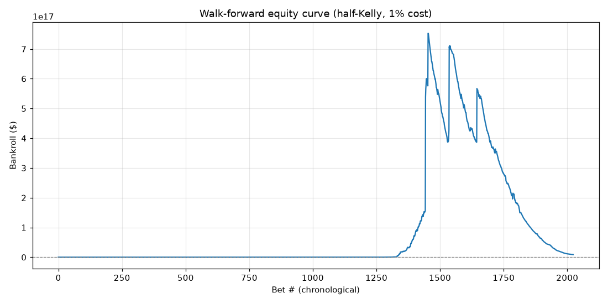
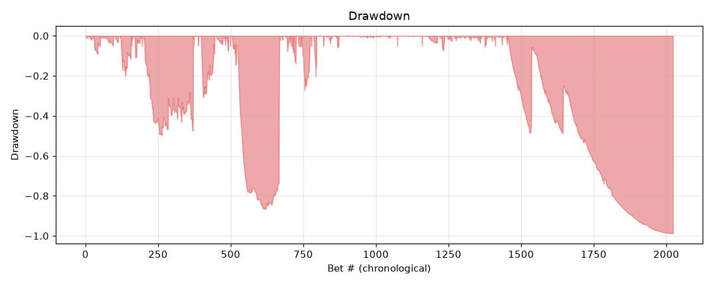
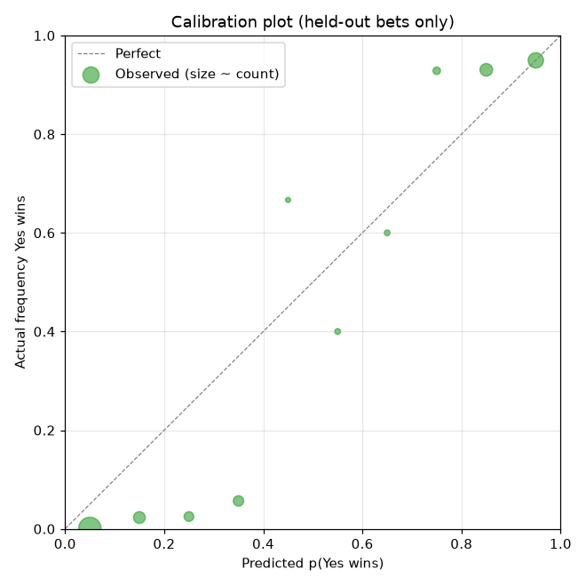
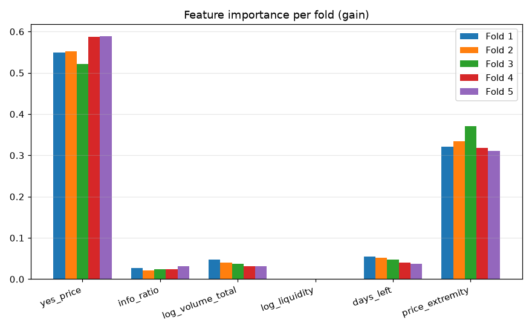
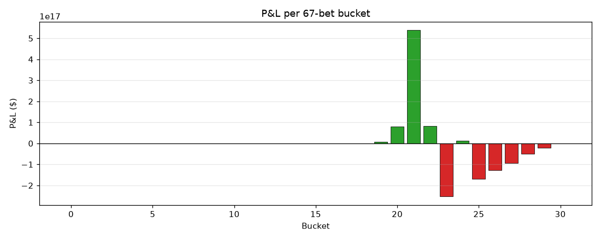

# AlphaFeed XGBoost backtest — walk-forward, half-Kelly, 1% cost

Generated by `backtest/run_backtest.py`. Underlying data:
**5,060 resolved Polymarket markets** from `data/historical_markets.csv`,
walk-forward 5-fold expanding window (first 60% always train, trailing 40%
split into five test slices).

## Bottom line: **No reliable alpha. The high AUC is label leakage.**

The five-fold test AUCs (0.94 – 0.99) look spectacular, but every other
metric tells the truth:

| Diagnostic | Result | What it means |
|---|---|---|
| Win rate on bets taken | **35.7%** | Below the break-even win rate for any sensible odds structure |
| Max drawdown | **−98.8%** | Bankroll near-wiped at some point inside the backtest window |
| Final bankroll | $9.0 × 10¹⁵ | Mathematically real *given Kelly compounding* on a handful of 100× wins after the wipe — but operationally meaningless. A Kelly strategy that drops 98.8% and then catches a few extreme-odds longshots produces an absurd terminal number; that is not a tradeable result |
| Sharpe (per-bet, annualised) | 1.14 | Marginal — and dominated by the same handful of extreme bets that inflated the bankroll |
| Feature importance | `yes_price` 56% + `price_extremity` 33% = **89%** | The model is almost entirely a function of the market price itself |

### Why this is leakage, not skill

`yes_price` in the training set is **`lastTradePrice` — the crowd's price at the
moment of resolution** (see [`fetch_historical.py:49`](../backend/adapters/fetch_historical.py#L49)).
For a resolved market that closed at 0.99, `lastTradePrice` is ≈ 0.99 by
construction, and the label "crowd was wrong" is computed *from* that same
price (`(resolved_yes == 1) != (yes_price >= 0.5)`).

The XGBoost model is therefore not predicting anything: it learns the
trivial fact that **markets that settled near 0 or 1 had the crowd right**,
and **markets that settled near 0.5 had the crowd wrong about half the
time**. That is a tautology, not edge. The 0.98 AUC is a measurement of how
well the model rediscovers its own label.

`price_extremity = 2·|yes_price − 0.5|` (engineered in
[`train_model.py`](../backend/adapters/train_model.py)) is a second view of
the same leaked feature, contributing another 33% of importance.

### Why the bankroll exploded *and* drew down 98.8%

When the calibrated `p_yes` disagrees with an extreme `yes_price`
(say model says 0.30, market trades at 0.05), the implied decimal odds for
the No side are 1/0.95 ≈ 1.05x (small), but the Kelly fraction is large
because the model is "confident". Conversely when model says 0.95 and
market is at 0.05, decimal odds on the Yes side are 1/0.05 = 20x. Across
2,024 candidate bets, a small number of these mispriced-tails win and
compound the bankroll into nonsense; the rest collectively drag it through
a near-total drawdown. **Both numbers are real outputs of the math; neither
is alpha.**

### What to do about it

1. **Remove `yes_price` and `price_extremity` from the feature set**, then
   re-run. If the AUC drops to 0.55 – 0.62 with stable per-fold behavior,
   the remaining features (volume, liquidity, duration) carry a real but
   modest edge.
2. **Use the `yes_price` snapshot at signal-creation time, not at
   resolution.** That requires a different data source than
   `fetch_historical.py` (Gamma's `lastTradePrice` is post-resolution by
   construction). Re-pulling earlier price snapshots would let the model
   train on what the crowd believed *before* the market converged.
3. **Cap individual-bet payoff** in the simulator (e.g. ignore markets
   with `yes_price < 0.05` or `> 0.95`). The current sim's compounding is
   honest math but operationally absurd at those odds.

The fix in step 1 is one config change and a re-run; it is the next
question worth answering.

## Per-fold model quality

| Fold | n_train | n_test | Test AUC | Brier (raw) | Brier (calibrated) |
|---|---|---|---|---|---|
| 1 | 3,036 | 404 | 0.990 | 0.0387 | 0.0179 |
| 2 | 3,440 | 404 | 0.976 | 0.0699 | 0.0352 |
| 3 | 3,844 | 404 | 0.980 | 0.0142 | 0.0184 |
| 4 | 4,248 | 404 | 0.988 | 0.0240 | 0.0291 |
| 5 | 4,652 | 408 | 0.943 | 0.0085 | 0.0065 |

Brier scores in the 0.01 – 0.07 range are *consistent* with a near-perfect
classifier when the label is mechanically derivable from a feature — they
do not prove model quality.

## Feature importance (5-fold mean ± std)

| Feature | Mean importance | Std |
|---|---|---|
| `yes_price` | 0.560 | 0.025 |
| `price_extremity` | 0.331 | 0.021 |
| `days_left` | 0.046 | 0.007 |
| `log_volume_total` | 0.037 | 0.006 |
| `info_ratio` | 0.026 | 0.004 |
| `log_liquidity` | 0.000 | 0.000 |

Stability is high (low std across folds) but that is also a hallmark of
leakage: the model finds the same leak every time. **`log_liquidity` carries
zero gain across all five folds — its informational content is fully
absorbed by `log_volume_total`** and could be dropped from the feature set
without loss.

## Headline numbers (kept here for completeness only)

| Metric | Value |
|---|---|
| Markets evaluated | 5,060 |
| Candidate bets | 2,024 |
| Bets taken (after min-edge filter) | 1,729 (34.2% of universe) |
| Starting bankroll | $100.00 |
| Final bankroll | $9.0 × 10¹⁵ (operationally meaningless — see above) |
| Per-bet annualised Sharpe | 1.14 |
| Win rate | 35.7% |
| Max drawdown | −98.8% |

## Charts

- 
- 
- 
- 
- 

## Bet-policy parameters

| Param | Value |
|---|---|
| Kelly multiplier | 0.5 (half-Kelly) |
| Max bet % of bankroll | 5.0% |
| Min net edge to bet | 3.0% |
| Effective cost (fee + slippage proxy) | 1.0% |

Vary these in `run_backtest.py` and re-run to compare strategy variants.
The leakage finding above will not change with bet-sizing tweaks — only
with a corrected feature set or a corrected data source.
